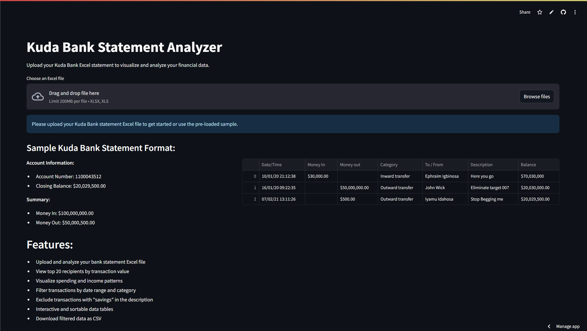

# Kuda Bank Statement Analyzer


## 🔗 [Live App: Kuda Statement Analyzer](https://kuda-statement.streamlit.app/)

A powerful web application for visualizing and analyzing your Kuda Bank statements. Upload your Excel statement and gain valuable insights into your financial transactions.



## ✨ Features

- **Upload & Analyze**: Upload your Kuda Bank Excel statement for instant analysis
- **Top Recipients**: Visualize your top recipients by transaction value
- **Spending Patterns**: View monthly spending and income patterns over time
- **Transaction Filtering**: Filter transactions by date range and category
- **Data Cleaning**: Automatically excludes transactions with "savings" in the description
- **Interactive Data**: Interactive and sortable transaction data tables
- **Data Export**: Download filtered transaction data as CSV

## 📊 Visualizations

- Transaction flow analysis
- Spending by category breakdown
- Monthly spending trends
- Income vs expense comparison
- Interactive transaction details

## 🔒 Privacy

Your financial data never leaves your browser. All processing happens client-side, ensuring your bank statement information remains completely private.

## 🚀 Getting Started

### Online (Recommended)

Visit the [live app](https://kuda-statement.streamlit.app/) and upload your Kuda Bank Excel statement.

### Run Locally

1. Clone the repository
   ```bash
   git clone https://github.com/username/Kuda-Bank-Statement-Analyzer.git
   cd Kuda-Bank-Statement-Analyzer
   ```

2. Install dependencies
   ```bash
   pip install -r requirements.txt
   ```

3. Run the app
   ```bash
   streamlit run app.py
   ```

## 📋 Expected Format

The application is designed to work with standard Kuda Bank statement Excel files with the following columns:
- Date/Time
- Money In
- Money out
- Category
- To / From
- Description
- Balance

## 💡 Tips

- For best results, use the Excel file directly downloaded from Kuda Bank
- Filter out savings transactions to focus on spending patterns
- Use the date range filter to analyze specific time periods

## 🛠️ Technologies

- [Python](https://www.python.org/) - Programming language
- [Streamlit](https://streamlit.io/) - Web app framework
- [Pandas](https://pandas.pydata.org/) - Data analysis
- [Plotly](https://plotly.com/) - Interactive visualizations
- [NumPy](https://numpy.org/) - Numerical computing

## 🤝 Contributing

Contributions are welcome! Feel free to submit issues or pull requests to help improve the application.

## 📜 License

This project is licensed under the MIT License - see the LICENSE file for details.

---

Created with ❤️ for Kuda Bank users
Made by Ephraim Igbinosa